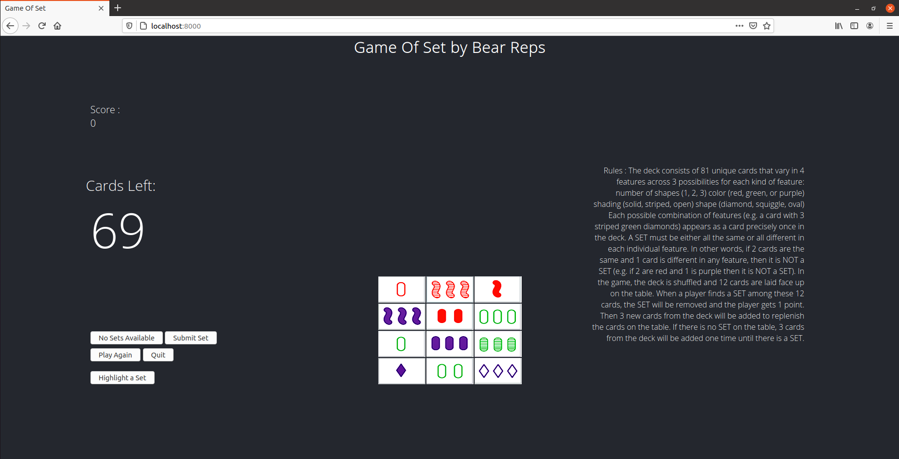

Set in JavaScript
--------

"Set" is a card game in which players attempt to find a group of cards that satisfy a particular criterion. 
It is a speed game: 12 cards are dealt face-up, and the players try to be the first to make a set from the visible cards. 
For a complete description of the game see the Wikipedia entry: https://en.wikipedia.org/wiki/Set_(card_game). 
This project creates a functional game of set using JavaScript, CSS, HTML. Node.js is used to run the game locally. 

Motivation
----------

This project was intended to combine what we have learned about JavaScript, CSS, and HTML by taking the our previous Ruby Set and making it in JavaScript using CSS and HTML.

Since we had already created the game before in Ruby the focus was on the JavaScript, CSS, and HTML instead of the logic of the game.

Features
--------

This project was implemented using multiple classes for the major functions for the game. 
The Classes were the Cards, the Deck maker, the Set parser, and Board maker. 
This version has a GUI that allows the user to visually select cards to make a set. The new GUI
also has the score and the rules displayed at all times, allowing a user to refer back during game play. 

A Node.js server is set up to allow for local play.
The GUI will react to a card being selected and unselects when clicked again.
A Debug Mode where Sets can be highlighted.

Current Errors
--------------

Play again doesn't remove new cards. 

Sometimes Sets aren't unselected.

Highlight Set button doesn't work when there are more than 12 cards on the field, possibly a problem with hasSet. Still Broken 
when New cards are toggleable.

Screenshots
-----------
 
Start Screen

 
End Screen

Installation
------------

Steps to install and run JavaScript Set:
1) Clone the BearReps repo and navigate to the "project2" directory.
2) Open a terminal in that folder and enter "node server.js" this hosts the game locally, If this outputs "Server is listening on port 8000" then it was successful.
3) Load a web browser and enter "http://localhost:8000" to the url box to play the game.
4) Once done pressing Control+C on the terminal running the game will shut down the Node.js server.

Tests
-----

The GUI version of this game requires less testing since the user can't input their own information.

1) Max 3 Cards Selected:

	Only 3 cards can be selected at a time though the GUI.
	
2) Quit Button
	
	The Quit button can be pressed anytime during gameplay to stop playing.
	
3) No Selection during give SET
	
	While being given a set, the player cannot pick a card to prevent errors.
	
	

Acknowledgment
---------------
Thanks to Ryan O'Donovan for being project lead for this project. He helped to coordinate the project by creating the meetings and the plans for who would work on which aspect of the project. He also created the Node.js server for running the game locally, converted the Board Class from ruby to javascript, and worked on bug fixing. 
Also for helping out in many parts of the project that people needed help with.

Andrew Conners converted the deckmaker class and helped to work on the HTML and refining the CSS.
He also generated separate images for each card by cropping a larger sheet with every card on it as well as adding event listeners to the main class.

Zhuo Chen converted the card class that is the framework of the game since the card is the basis of the game.

Eric Young worked on the main class which handles pulling everything together and is the core of the project. 

Michael Cromlish converted the card parsing class that handles checking the cards and seeing if they are a set or not and did some light CSS formatting and worked on bug fixing.

Samiul Islam helped out in many parts of the project with a focus on the HTML and the helping out on the main and card classes. Also for writing many of the event listeners and working on bug fixing. 

Credit
------

README guidelines:
makeareadme.com and "A Beginners Guide to writing a Kickass READMe" by Akash Nimare

Ryan O'Donovan, for creating the original readme which this one is based on.

The original image sheet that the individual card images were cropped from. https://geekandsundry.com/the-card-game-that-puzzled-mathematicians-for-decades/

